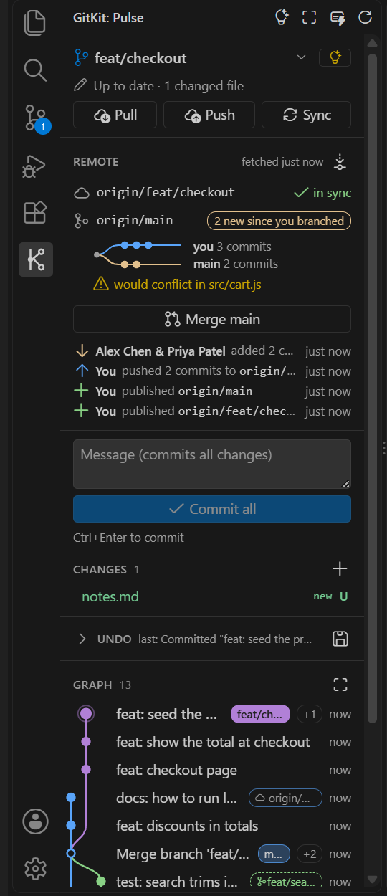
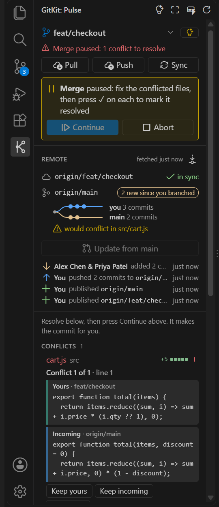
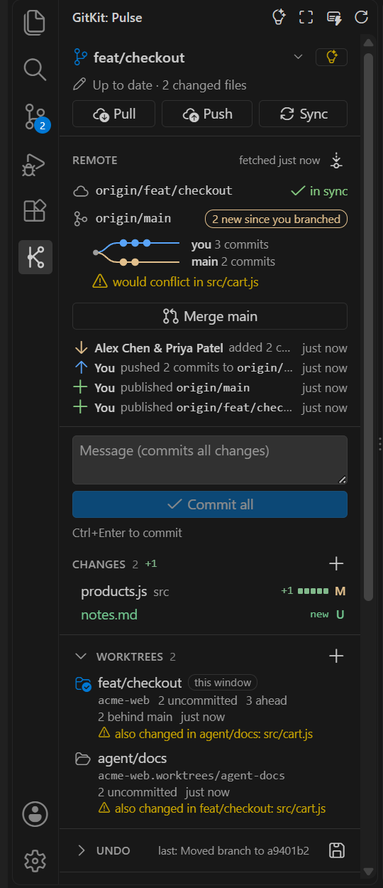
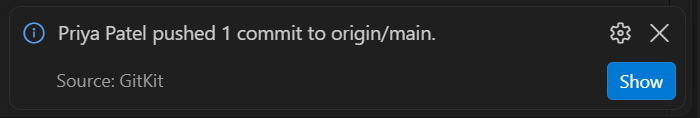
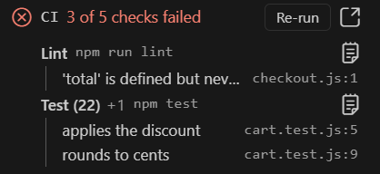
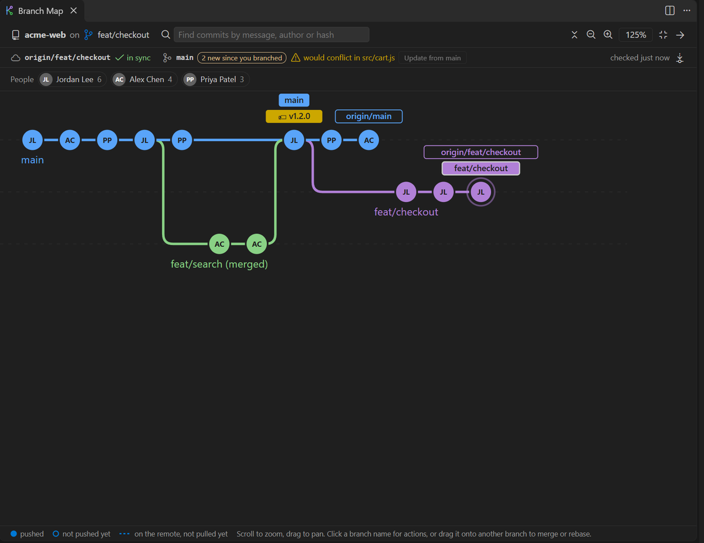
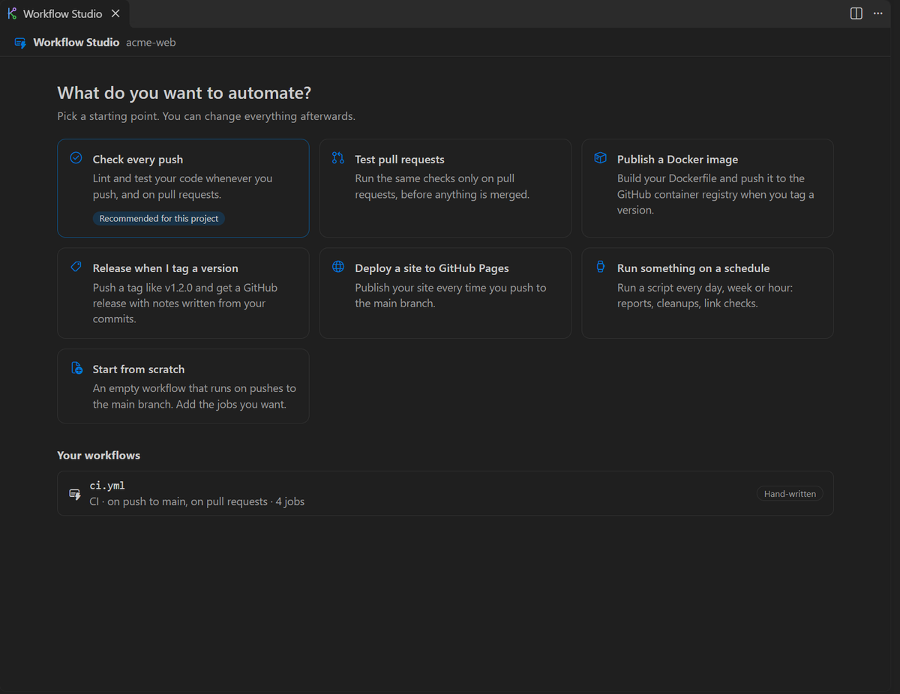
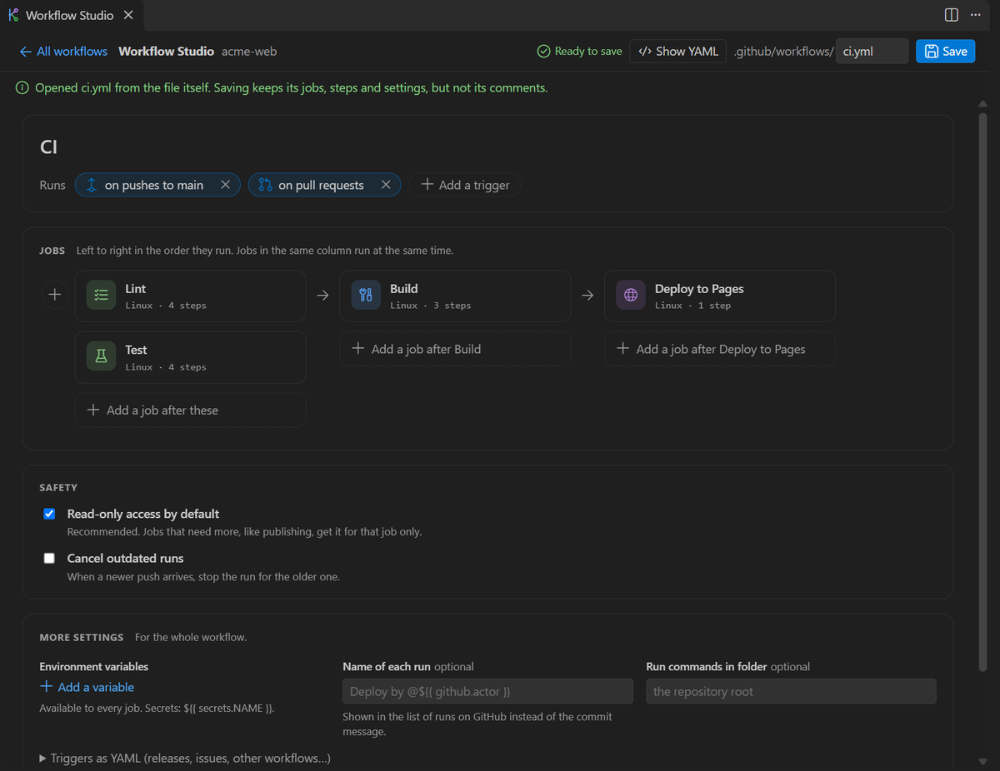
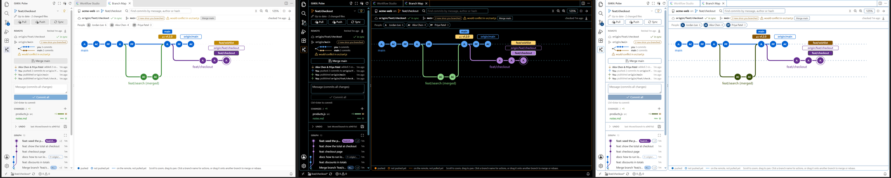

<p align="center">
  
</p>

<h1 align="center">GitKit</h1>

<p align="center">
  <strong>Git and GitHub in VS Code, made visual and safe.</strong><br />
  See where you stand at a glance. Undo almost anything. Never get lost in a merge again.
</p>

<p align="center">
  <a href="LICENSE"></a>
  
</p>

<p align="center">
  
</p>

GitKit adds a panel to VS Code that tells you, in plain words, what's going on in your project: what you've changed, what's waiting to be pushed, what your teammates did, and whether merging will go smoothly. The everyday actions are one click away, and the scary ones come with a safety net.

**Nothing happens behind your back.** Hover any button to see exactly what it will do. Anything that rewrites history asks first, and work you throw away is kept so you can get it back.

<table>
  <tr>
    <td align="center" width="33%"></td>
    <td align="center" width="33%"></td>
    <td align="center" width="33%"></td>
  </tr>
  <tr>
    <td align="center"><sub><b>Where you stand</b>, and a warning before a merge would conflict</sub></td>
    <td align="center"><sub><b>Conflicts</b> explained, one click per change</sub></td>
    <td align="center"><sub><b>Several tasks at once</b>, with overlaps flagged</sub></td>
  </tr>
</table>

## What you can do

### Know where you stand

- **One sentence tells you the state of things:** _"1 commit ready to push"_, _"3 new commits on the remote"_, _"2 to push, 1 to pull"_.
- **Pull, Push and Sync** buttons, with the one you probably want highlighted. Pull never creates a surprise merge.
- **Your changes, file by file,** with how many lines you added and removed. Commit with one box and one button.
- **Switch branches** from a list that shows which ones are ahead, behind, or only on your machine.

### Stay in step with your team

- **A heads-up when teammates push.** GitKit checks for new commits every few minutes while you work. When someone pushes to your branch or to main, you get a pop-up like _"Priya Patel pushed 2 commits to origin/main"_ and a count on the GitKit icon until you take a look.
- **See how far you've drifted from main,** and whether merging it in would conflict, before you try. GitKit test-merges in memory, without touching your files.
- **Bring in main's latest work in one click,** with a backup saved first.
- **Recent activity** in plain words: _"Alex Chen added 2 commits to origin/main"_.

<p align="center">
  
</p>

### Know when (and why) your checks fail

- **Your GitHub checks** for the latest commit you pushed, with a **Re-run** button for the ones that failed.
- **See why they failed without leaving VS Code:** which job failed, the step it stopped at, and the failing tests or errors. Click an error to jump to that line in your code, or open the failed step's log with the cursor on the first error.
- **Pull requests:** one line says if yours is ready (_"checks passing, review needed, 2 unresolved comments"_). No pull request yet? GitKit drafts the title and description from your commits.

<p align="center">
  
</p>

### See your branches as a map

Each branch gets its own colored lane, so you can see where branches split off and merge back. Commits you haven't pushed yet, and ones on the remote you haven't pulled, are drawn differently so they stand out.

Open the **Branch Map** for the full picture in a tab of its own, and work right in it: drag one branch onto another to merge, click a branch to switch to it, right-click a commit to undo it or copy it elsewhere. Search by message or person, and zoom out to see a long history at once.

<p align="center">
  
</p>

### Fix conflicts calmly

When a merge stops on a conflict, GitKit shows each one as **your version** next to **the incoming version**, with buttons to keep yours, keep theirs, keep both, or open VS Code's merge editor. Changed your mind? Ctrl+Z works, and **Abort** puts everything back exactly as it was.

### Undo mistakes with Oops

One menu for the problems people search for most:

- Undo the last commit but keep the changes (safely, even if you already pushed it)
- Fix the last commit's message, or add a file you forgot
- Move commits you made on the wrong branch
- Bring back a deleted branch or changes you discarded
- Clean up branches that are already merged
- Step back through a timeline of what happened, and undo the undo

### Commit without worry

Before each commit, GitKit checks what you're about to save and warns you about:

- **Passwords and keys** that look real (AWS, GitHub, Stripe, OpenAI and many more), with a jump to the exact line
- **Files that usually shouldn't be shared,** like `.env` files and very large files
- **The wrong email address,** if you use different ones for work, school and personal projects

### Work on several things at once

Worktrees let you have several branches open at the same time, each in its own folder, which is handy for running more than one AI coding agent side by side.

- **See every worktree** with its changes and how far it is from main, and open any of them in a new window.
- **Create one in a click,** optionally copying settings files and running a setup command like `npm install`.
- **Know when two of them overlap:** _"agent/auth and agent/docs both changed auth.py"_.
- **Checkpoints:** GitKit quietly saves a snapshot of a worktree's files when a coding agent starts, so you can roll back if it goes wrong.

### Build GitHub Actions without writing YAML

**Workflow Studio** starts from what you want to automate: test every push, check pull requests, publish a Docker image, release a version, deploy a website, or run something on a schedule. GitKit suggests the ones that fit your project.

<table>
  <tr>
    <td width="50%"></td>
    <td width="50%"></td>
  </tr>
  <tr>
    <td align="center"><sub>Start from what you want to automate</sub></td>
    <td align="center"><sub>Existing workflows open as cards you can edit</sub></td>
  </tr>
</table>

- When it runs reads as a sentence, like _"runs on pushes to main and on pull requests"_. Schedules are picked from a list (every day at 06:00 UTC, every Monday…).
- Jobs are cards, left to right in the order they run. Pick the operating system and versions to test with checkboxes.
- Workflows get only the permissions they need, and GitKit checks your workflow against GitHub's rules before saving, so mistakes show up in VS Code instead of on GitHub.

### Fits right in

GitKit uses your theme's colors, so it looks at home in light, dark and high-contrast themes. Open a folder with several projects in it and GitKit finds each one.

<p align="center">
  
</p>

## Getting started

You need **VS Code 1.95** or newer and **git 2.38** or newer.

1. Install GitKit. Until it's on the Marketplace, download the `.vsix` file from a release, then in VS Code open the Extensions view, choose **…** → **Install from VSIX…**, and pick the file.
2. Open a folder that has a git project in it.
3. Click the **GitKit** icon in the bar on the left.

The icons at the top of the panel open **Oops**, the **Branch Map** and **Workflow Studio**. Every GitKit command is also in the Command Palette (Ctrl+Shift+P) under **GitKit**.

## Settings

The ones you're most likely to change. Open VS Code's settings and search for **GitKit** to see them all.

| Setting                         | What it does                                                                                                               |
| ------------------------------- | -------------------------------------------------------------------------------------------------------------------------- |
| `gitkit.autoFetchMinutes`       | How often to check for teammates' new commits, in minutes (default 5). `0` turns it off.                                   |
| `gitkit.newCommitAlerts`        | How to tell you about them: a pop-up and a count on the icon (`popup`, the default), `badge` for just the count, or `off`. |
| `gitkit.ciStatus`               | Show your GitHub checks and pull request (on by default).                                                                  |
| `gitkit.mainBranchColor`        | The color of the main branch's lane: `blue`, `green`, `purple`, `orange`, `red`, `yellow` or any color.                    |
| `gitkit.commitGuard.enabled`    | Check commits for passwords, keys and files that shouldn't be shared (on by default).                                      |
| `gitkit.identities`             | Which email to commit with for which projects, so work and personal don't get mixed up. See below.                         |
| `gitkit.worktrees.setupCommand` | A command to run in each new worktree, such as `npm install`.                                                              |

For example, to use your university email for one GitHub organization and your work email in one folder:

```json
"gitkit.identities": [
  { "remote": "github.com/my-university-org/**", "email": "me@university.edu" },
  { "folder": "D:/Work", "email": "me@company.com", "name": "My Name" }
]
```

## Privacy

- GitKit works with the `git` already on your computer. It only goes online when you push or pull, to check for new commits, and, if you leave GitHub checks on, to read your checks and pull request from GitHub.
- There is no telemetry: nothing about you or your code is collected.
- GitHub sign-in uses the account VS Code already knows, and GitKit only asks when you click **Sign in** or open a check's log.
- Checkpoints stay on your computer and are never pushed.

## Contributing

Ideas, bug reports and pull requests are welcome. See [CONTRIBUTING.md](CONTRIBUTING.md) to get set up.

## License

[MIT](LICENSE) © Sam Selvaraj
